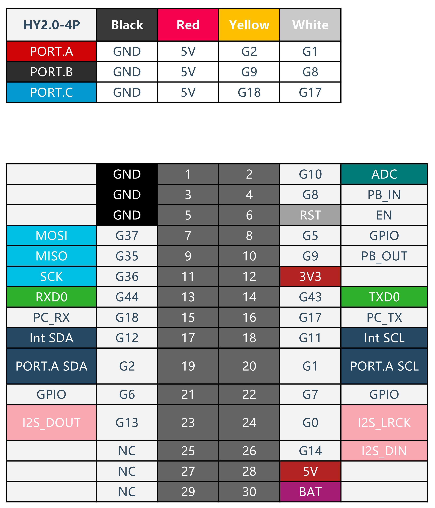

# ZT-rovate-BP08A

最終更新日: 2026年2月16日
対応バージョン: v1.0.0


**rovate** は **zeatec** が開発するロボットシリーズのブランド名です。
このプロジェクトは、**ZT-rovate-BP08A** 二足歩行ロボット用のM5Stack CoreS3コントローラー・アプリケーションです。

---

## 主な特徴

- タッチUIによる直感操作（ボタン・スライダー・スイッチ）
- シリアル通信（テキスト/バイナリ/JSON）・UDP通信対応
- PCクライアント（Python/pygame, UDP/シリアル）で外部制御・可視化
- IMU（加速度・ジャイロ）・サーボ・モーター制御
- 拡張性の高いアプリ構造（AppManager/テンプレート）

---

## ディレクトリ構成

- `src/` : メインソースコード（アプリ・UI・システム・タイマー等）
- `lib/` : 外部ライブラリ（例: MPU6886_AHRS）
- `include/` : ヘッダファイル
- `tools/pc_client/` : PC用クライアント（Python）
- `docs/` : ドキュメント

---

## 通信テストの解説

詳細な解説は、通信関係の以下のREADMEファイルを参照してください。**クリックですぐに開きます：**

- 📡 **[シリアル通信（テキスト・JSON）のHello World例](src/system/comm/README_serial_command.md)**
  - PowerShellでの簡単なサーボ制御例
  - PCクライアント（serialcontrol.py）を使った対話的テスト

- 📋 **[シリアル通信（バイナリモード）のHello World例](src/system/comm/README_serial_command.md#hello-worldwindowsでバイナリ通信をテストする)**
  - CRC16-CCITT計算を含むPythonスクリプト例
  - PING・サーボ制御・全サーボ設定の実装

- 📡 **[WiFi/UDP通信のHello World例](src/system/comm/README_wifi_command.md#hello-worldwindowsでudp通信をテストする)**
  - GUIツール（udpcontrol.py）での最も簡単なテスト
  - Pythonソケット通信例・IMU値リアルタイム受信

### 推奨テスト手順

1. **デバイス接続** : M5Stack CoreS3をUSBで接続
2. **上記のいずれかのREADMEを開く** : クリックで詳細なHello World例を確認
3. **簡単な事例実行** : 記載されているスクリプトをコピー・実行
4. **動作確認** : サーボが動いたり、センサ値が表示されることを確認

### 💡 注意: AI支援ツール活用の強い推奨

通信テストが正常に動作することを確認した後、**本格的なカスタマイズやアプリ開発を行う場合は、GitHub Copilot等のAI支援コーディングツールの利用を強く推奨します。**

**なぜ推奨するのか：**
- 🚀 **開発効率5～10倍向上** : ボイラープレート・通信処理・UIロジックの自動生成
- 🎯 **コンテキスト認識** : 既存コード（AppManager、I2C通信等）を理解した補完提案
- 🐛 **デバッグ高速化** : コンパイルエラーやロジックバグの原因・解決策を即座に提示
- 📚 **学習効果** : 提案されたコードから、M5StackやESP32の最適な実装パターンを学習
- 🔧 **複数言語対応** : C++（ファームウェア）・Python（PCクライアント）・JSONすべてに対応


詳細は下記の「[AI支援コーディング](#ai支援コーディングgithub-copilot等)」セクションを参照してください。

---

## 開発環境

### システム要件

#### ハードウェア
- **M5Stack CoreS3** 或いは **M5Stack CoreS3 SE** （主要な開発対象）
- **USB Type-C ケーブル** （データ通信対応）
- X線機器対応のI2Cセンサー・サーボドライバ等の外部デバイス（オプション）

#### OS・コンピュータ
- **Windows 10以上** / **macOS 10.15以上** / **Linux（Ubuntu 18.04以上推奨）**
- RAM: 4GB以上（PlatformIO初期セットアップには6GB以上推奨）
- ディスク容量: 2GB以上（PlatformIO, ツールチェーン含む）

### 必要なツール・環境

#### 1. **VS Code** （フロントエンド統合開発環境）
- **バージョン**: 1.50以上
- **ダウンロード**: [https://code.visualstudio.com/](https://code.visualstudio.com/)
- **役割**: ソースコード編集、デバッグ、ビルド実行

#### 2. **PlatformIO IDE** （VS Code拡張機能）
- **バージョン**: 3.0以上
- **インストール**: VS Code内の拡張機能マーケットから「PlatformIO IDE」を検索して導入
- **役割**: 
  - ファームウェアのビルド・コンパイル
  - M5Stack CoreS3への書き込み
  - シリアルモニター（ログ表示・デバッグ）
  - 自動ツールチェーンダウンロード（初回のみ10-20分）

#### 3. **Python 3.8以上** （PCクライアント実行用）
- **ダウンロード**: [https://www.python.org/](https://www.python.org/)
- **確認**: `python --version` コマンドで確認
- **役割**: 
  - PCクライアントアプリケーション（tools/pc_client/）の実行
  - UDP・シリアル通信でロボットを外部制御
  - ログ送受信・可視化

#### 4. **Git** （バージョン管理）
- **ダウンロード**: [https://git-scm.com/](https://git-scm.com/)
- **確認**: `git --version` コマンドで確認
- **役割**: ソースコード管理・バージョン追跡

### プロジェクト関連の依存ライブラリ

#### ESp32開発ボード用フレームワーク
- **Arduino Framework** （ESP32用）
  - M5Stack CoreS3は Arduino IDE互換
  - PlatformIOが自動でダウンロード・セットアップ

#### ファームウェア内組み込みライブラリ
- **M5Core2/M5CoreS3対応ライブラリ**
  - 画面制御・タッチ入力・GPIO操作
  - PlatformIO自動取得（platformio.ini）
- **MPU6886_AHRS** （本プロジェクト内）
  - IMU（加速度・ジャイロ）処理
  - Madgwick's AHRS実装

#### PCクライアント依存ライブラリ（Python）
詳細は [tools/pc_client/requirements.txt](tools/pc_client/requirements.txt) を参照
- **pygame** : グラフィカルUI・ゲーム風操作パネル
- **pyserial** : シリアル通信
- **その他**: UDP通信用ライブラリ等

### セットアップ手順

#### A. 開発ボード（VS Code + PlatformIO）のセットアップ

**ステップ1: VS Codeをインストール**
```bash
# Windows: MSIインストーラーから、またはスクリーンショット参照
# macOS: brew install --cask visual-studio-code
# Linux: スナップパッケージ or 公式リポジトリから
```

**ステップ2: PlatformIOを拡張機能から導入**
1. VS Codeを起動
2. 左側のアイコン「拡張機能」をクリック（四角が4つのマーク）
3. 検索窓に `PlatformIO` と入力
4. 「PlatformIO IDE」（公式、大量ダウンロード）をインストール  
5. VS Codeをすべて終了して再起動
6. 初回のみツールチェーンの自動ダウンロードが走ります（15-25分程度）

**ステップ3: プロジェクトを開く**
1. VS Codeで「ファイル」→「フォルダーを開く」
2. ZT-rovate-BP08Aプロジェクトフォルダを指定
3. 左下に PlatformIO アイコンが表示されればセットアップ完了

**ステップ4: M5Stack CoreS3をUSBで接続**
- Type-C USBケーブルでパソコンに接続
- デバイスマネージャー or `pio device list` で認識確認

#### B. PCクライアント（Python）のセットアップ

**ステップ1: Python環境の準備**
```bash
# Pythonインストール確認
python --version  # 3.8以上

# 仮想環境作成（推奨）
cd tools/pc_client
python -m venv venv

# 仮想環境有効化
# Windows:
venv\Scripts\activate
# macOS/Linux:
source venv/bin/activate
```

**ステップ2: 依存ライブラリのインストール**
```bash
pip install -r requirements.txt
```

**ステップ3: PCクライアントを実行**
```bash
# シリアル制御（テキスト）
python serialcontrol.py

# シリアル制御（バイナリ）
python serialcontrol_binary.py

# UDP制御
python udpcontrol.py
```

### AI支援コーディング（GitHub Copilot等）

本プロジェクトの開発効率向上のため、 **GitHub Copilot** などのAIコーディング支援ツールの活用を推奨します。

#### GitHub Copilotとは

**GitHub Copilot** は、OpenAIの大規模言語モデル（GPT）をベースとしたAI駆動型コード補完ツールです。VS Codeに拡張機能として導入でき、以下の特徴があります：

- 🤖 **コンテキスト認識補完** : ファイルの既存コードから文脈を読み取り、次のコード行を自動提案
- 💡 **関数・クラス生成** : コメント（プロンプト）から関数やクラスのボイラープレートを自動生成
- 🔍 **エラー対応** : 既知のバグパターンから警告や修正提案
- 📚 **複数言語対応** : C++、Python、JavaScript、JSON等、本プロジェクトで使用するすべての言語に対応
- 🚀 **開発速度向上** : 定型処理・API呼び出し・テストコード等を高速入力

#### インストール手順

**ステップ1: GitHub Copilotのアカウント準備**
1. [github.com](https://github.com) でGitHubアカウントを作成（無料）
2. [GitHub Copilot](https://github.com/features/copilot) のページから、60日間無料トライアル or サブスクリプション登録
   - 学生・教育機関は無料プランあり
   - 個人開発者は月額10ドル程度

**ステップ2: VS Code拡張機能をインストール**
1. VS Codeを起動
2. 左側の「拡張機能」をクリック
3. 検索窓に `GitHub Copilot` と入力
4. 公式の「GitHub Copilot」拡張機能をインストール
5. VS Codeを再起動
6. GitHubアカウントでログイン（ブラウザで認証画面が開きます）

**ステップ3: Copilotチャット（高度な機能）の有効化**
1. 同じく拡張機能から「GitHub Copilot Chat」もインストール（オプション）
2. コマンドパレット（Ctrl+Shift+P）から「Chat: Open」を実行
3. サイドバーにチャットウィンドウが表示される

#### 基本的な使い方

##### 1. **インライン補完（自動提案）**

コード入力時に自動でコード案が灰色で表示されます：
```cpp
// src/App/AppMotor/AppMotor.cpp のサンプル

void AppMotor::handleButtonPress() {
    // [Copilotが自動提案]
    // motor_speed = 255;
    // delay(100);
    // motor_speed = 0;
}

// キー: [Tab] で提案を受け入れ、[Esc] で拒否
```

##### 2. **コメント駆動開発（Prompt-based）**

コメントを書いて、Copilot に実装させる：
```cpp
// Create a function that converts servo angle (0-180) to PWM value (500-2500)
// [Ctrl+Shift+A] もしくは自動提案を受け入れて実装
int servoAngleToPWM(int angle) {
    // Copilot実装例:
    // return 500 + (angle * 2000 / 180);
}
```

##### 3. **Copilot Chatでの質問・会話コーディング**

左側パネルの「Chat」アイコン（❤️ アイコン）をクリック：

```
【Q】M5Stack CoreS3でI2C通信するサンプルコードをください
【A】Wire.beginTransmission(0x68);
    Wire.write(0x3B); // レジスタアドレス
    Wire.endTransmission();
    Wire.requestFrom(0x68, 6);
    ...
```

**チャット活用例：**

| 用途 | プロンプト例 |
|------|------------|
| **関数実装** | "M5Stack CoreS3の加速度センサーからX軸値を読み取る関数を書いて" |
| **バグ修正** | "このコードがコンパイルエラーになります。[コード貼り付け]原因と修正方法は？" |
| **リファクタリング** | "このC++コード を簡潔にしてください" |
| **ドキュメント** | "このクラスの説明コメント（Doxygen形式）を生成して" |
| **テストコード** | "このPython関数のユニットテストを書いてください" |
| **アーキテクチャ** | "M5Stack で複数のI2Cデバイスを効率よく管理する設計パターンは？" |

#### 本プロジェクトでの推奨活用法

##### C++開発（ファームウェア開発）での活用

1. **新しいApp の実装**
   ```cpp
   // AppTemplateをベースに、Copilot チャットで：
   // "AppMotorのサーボコントロール機能を実装するにはどうしたらいい？"
   // → ServoControllerクラスの設計提案が返ってくる
   ```

2. **IMU・センサー処理**
   ```cpp
   // "MPU6886から角速度を読み込んでジャイロドリフト補正するコードは？"
   // → Madgwick AHRSの実装例が提案される
   ```

3. **UI部品追加**
   - 新しいButtonやSliderの実装時に、既存コードパターンから自動生成

##### Python開発（PCクライアント）での活用

1. **UDP/シリアル通信機能**
   ```python
   # "UDP通信でM5Stackにサーボ角度を送信するコードをください"
   # → socketライブラリを使った実装が自動生成
   ```

2. **データ処理・可視化**
   ```python
   # "受信したセンサーデータをCSVに保存して、グラフで表示するコードは？"
   # → pandasやmatplotlibの活用例が生成される
   ```

3. **テストスクリプト**
   - serialcontrol.py の単体テストコード自動生成

#### ベストプラクティス・注意点

| 項目 | 説明 |
|------|------|
| **詳細なプロンプト** | 「関数を書いて」より「ESP32のI2C 7-bit アドレスで0x68のデバイスに0x3Bレジスタから6バイト読み込む関数を書いて」が精度高い |
| **既存コード参照** | ファイルを開いた状態でChatを使用すると、文脈认識が向上（`#include`や`using namespace`をコピペできる） |
| **生成コードの検証** | Copilot出力は100%正確ではない。データシート確認・テスト実行は必須 |
| **セキュリティ** | コメント・変数名に機密情報（WiFi パスワード等）を含めない |
| **ライセンス** | 生成コード（MIT LicenseAのこのプロジェクト）の利用は原則OK。ただし、商用利用時は利用規約確認 |

#### よくある質問

**Q: Copilot は完璧なコードを生成しますか？**
A: いいえ。特に複雑なロジック・プロジェクト固有の処理では、提案内容を必ず確認・修正してください。補助ツールと考えてください。

**Q: 無料で使えますか？**
A: 基本は有料（月額$10）ですが、学生・オープンソースプロジェクト開発者は無料。60日間の無料トライアルもあります。

**Q: ローカル環境対応ですか？**
A: VS Code内で動作します。データはGitHub/Microsoftサーバーに送信されます。機密データの送信を避けたい場合は、Copilot Local（ベータ）の検討を。

**Q: 他のツール（Codeium, Tabnine等）はどう？**
A: 代替ツールもあります。本プロジェクトでは GitHub Copilot推奨ですが、自由に選択可能です。

#### チャットコーディング ワークフロー例

```
1. [概要設計] Copilot Chat で「M5Stack CoreS3でロボット制御アプリのアーキテクチャを設計」
    ↓
2. [スケルトン生成] 提案されたクラス構成を AppManager/AppTemplate をベースに作成
    ↓
3. [関数実装] コメント駆動 → Copilot の インライン補完/Chat で実装
    ↓
4. [エラー修正] コンパイルエラーをChatに貼り付け → 修正提案を受ける
    ↓
5. [テスト] テストコード自動生成 → 実行・デバッグ
    ↓
6. [ドキュメント] 関数コメント・READMEも Copilot で自動生成（確認必須）
```

---

### ビルド・デプロイ方法

#### ファームウェアのビルド（ハードウェアに書き込み）

**方法1: VS Code UI からの操作（推奨）**
1. PlatformIO アイコンをクリック
2. 「PROJECT TASKS」セクション内の「Build」をクリック
   - コンパイルが実行される
   - エラーがあれば「PROBLEMS」タブに表示
3. ビルド成功後、「Upload」をクリック
   - M5Stack CoreS3にファームウェアが書き込まれる
   - 完了後、デバイスが自動リセット

**方法2: ターミナルコマンド**
```bash
# ビルドのみ
pio run

# ビルド + 書き込み
pio run --target upload

# ポート指定（複数デバイス接続時）
pio run --target upload --upload-port COM3  # Windows
pio run --target upload --upload-port /dev/ttyUSB0  # Linux
```

**方法3: シリアルモニターで動作確認**
```bash
# ターミナルからシリアルモニター開始
pio device monitor --port COM3 --baud 115200  # Windows例

# VS Code内: PlatformIO サイドバー → Serial Monitor
```

### トラブルシューティング

| 問題 | 原因・解決方法 |
|------|---------------|
| **「PlatformIO not found」エラー** | VS Codeの再起動後、拡張機能が完全に有効化されていない。再度再起動してください。 |
| **「ボードが認識されない」** | ：USB接続確認・ドライバインストール確認（Windows）。コマンド `pio device list` でポート確認。 |
| **ビルドエラー「undefined reference」** | ライブラリが正しく読み込まれていない。platformio.ini の lib_deps を確認し、キャッシュをクリア（`pio run --target clean`） |
| **シリアルモニター接続できない** | ボーレート設定 `--baud 115200` 確認。他のアプリがシリアルポート使用中でないか確認。 |
| **Python実行時「ModuleNotFoundError」** | 仮想環境有効化・requirements.txt からの再インストール。`pip list` で確認。 |
| **M5Stack CoreS3画面が反応しない** | デバイスが書き込み制限モード（DFU）の可能性。リセットボタン（背面）を3秒押してリセット。 |

### 開発ワークフロー例

```
1. [コード編集] src/ 内の機能を編集
    ↓
2. [ビルド] PlatformIO: Build実行
    ↓
3. [書き込み] USB接続状態で Upload 実行
    ↓
4. [動作確認] Serial Monitor でログ確認
    ↓
5. デバッグが必要なら1に戻る
    ↓
6. 完成後、PCクライアントで外部制御テスト（オプション）
```

---

## 通信仕様・プロトコル

本プロジェクトは以下の通信方式に対応しています：

- **シリアル通信（テキスト/JSON/バイナリ）**
    - 詳細: [src/system/comm/README_serial_command.md](src/system/comm/README_serial_command.md)
- **UDP通信**
    - 詳細: [src/system/comm/README_wifi_command.md](src/system/comm/README_wifi_command.md)

---

## クイックスタート

1. M5Stack CoreS3に書き込み
2. PCクライアント（tools/pc_client/）で接続
3. タッチUIでロボットを操作

---

## 参考・詳細ドキュメント

- [src/README.md](src/README.md) : ソース構成・役割
- [lib/MPU6886_AHRS/README.md](lib/MPU6886_AHRS/README.md) : IMUライブラリ
- [src/UI/README.md](src/UI/README.md) : UI部品
- [src/system/README.md](src/system/README.md) : システム基盤

---

## 注意事項

- グローバル変数や初期化処理はsystem配下にまとめる
- 新規アプリ追加時はAppTemplateを参考に
- 詳細は各README参照

---

## ライセンス

MIT License

---

## 作者

zeatec

---

## バージョン情報

- v1.0.0 (2026/02/16) 初版公開

---
- **UDP通信（PC⇔ロボット）**
    - 詳細: [src/App/AppWifi/README.md](src/App/AppWifi/README.md), [tools/pc_client/README.md](tools/pc_client/README.md)

通信コマンド例やフォーマットは各READMEに記載しています。


<h2 id="このプロジェクトについて">🎯 このプロジェクトについて</h2>

### 何ができるの？

このプロジェクトは、ZT-rovate-BP08Aの制御に以下のような機能を備えています：

- 📱 **複数の制御画面** でロボットの各機能を操作
- 🖱️ **タッチ操作** に対応したUI部品（ボタン、スライダー、スイッチ）
- 🏠 **ホーム画面** から各種操作モードを選択
- 🔄 **モード切り替え** が簡単
- ⏱️ **タイマー機能** で定期的なセンサー更新や制御処理
- 🔌 **I2C通信** で外部デバイス（モーター、センサーなど）と接続

### 対象ハードウェア

- **M5Stack CoreS3** (SE含む) - ZT-rovate-BP08A コントローラー
- タッチスクリーン対応 - ロボット制御用UI
- ESP32ベース - 高速処理対応
- **I2C通信機能** - モーター制御、センサー接続用

---


<h2 id="ピンアサイン外部接続i2c回路構成について">🛠️ ピンアサイン・外部接続・I2C回路構成について</h2>

<div align="center">
    
</div>

### I2C回路構成（接続デバイス一覧）

本機は2系統のI2Cバスを持ち、各バスに以下のデバイスが接続されています（コード・スキャンアプリより）：

#### PORT.A（外部I2C, Wire）
- SDA: GPIO2
- SCL: GPIO1
- 主な接続デバイス例：
        - **PCA9685 サーボドライバ**（アドレス: 0x40）
        - **MPU6886 IMU**（アドレス: 0x68）
        - その他、外部I2Cデバイス（OLED, ADC, I/O拡張等）も接続可能

#### 内部I2C（Wire1）
- SDA: GPIO21
- SCL: GPIO22
- 主な接続デバイス例：
        - 内部拡張用（標準では特定デバイス未接続）

#### 代表的なI2Cデバイスとアドレス
| アドレス | デバイス名           |
|---------|---------------------|
| 0x68    | MPU6886 IMU         |
| 0x40    | PCA9685 サーボドライバ |
| 0x3C    | SSD1306 OLED        |
| 0x48    | ADS1115 ADC         |
| 0x27    | PCF8574 I/O         |
| 0x20    | MCP23017 I/O        |
| 0x76    | BME280 センサ       |
| 0x54/0x58| STAMPS3             |


### 主要ピンアサイン（M5Stack CoreS3）

- **30ピン（BAT）**: リチウムポリマーバッテリーが直接接続されています。外部から電源を供給する場合やバッテリー交換時は、必ず極性・電圧に注意してください。
    - BATピンはバッテリー電圧（3.7V系）がそのまま出力されます。
    - USB給電時は自動的に充電されます。
- **6ピン（WS2812）**: 外部接続のアドレサブルLED（WS2812, NeoPixel等）用データ出力ピンです。
    - デフォルトでは16個のWS2812 LEDに対応しています。
    - LEDの電源（5V/GND）は別途供給してください。
    - LEDの信号線は6ピン（GPIO6）に接続します。

#### WS2812（外部LED）の点灯色について

本体から外部WS2812（NeoPixel）LEDを制御しています。LEDの点灯色は主に以下のような意味を持ちます：

- **起動時**: 全LEDが黄色に点灯（システム起動中）
- **通常動作時**:
    - 先頭（0番目）: 赤色（基準マーカー）
    - 最後（15番目）: 青色（基準マーカー）
    - 中央付近（6,7,8番目）: 通信状態やバッテリー残量で色が変化
        - 通信OK時: 緑色で点滅
        - 通信NGや通常時: バッテリー残量に応じて色が変化
            - 30%未満: 赤
            - 30-40%: オレンジ
            - 40-60%: 黄
            - 60%以上: 白
    - その他のLED: バッテリー残量に応じて上記と同じ色で点灯

LEDの本数やピン番号は `src/main.cpp` の `#define WS2812_PIN 6` および `#define WS2812_COUNT 16` で変更可能です。

---

<h2 id="クイックスタート初心者向け">🚀 クイックスタート（初心者向け）</h2>

### 必要なもの

1. **M5Stack CoreS3** 本体
2. **パソコン**（Windows/Mac/Linux）
3. **USBケーブル**（Type-C）
4. **開発環境**：
   - [VS Code](https://code.visualstudio.com/)
   - [PlatformIO](https://platformio.org/)（VS Codeの拡張機能）

---

### ステップ1: 開発環境のセットアップ

#### 1-1. VS Codeをインストール

[https://code.visualstudio.com/](https://code.visualstudio.com/) からダウンロードしてインストール

#### 1-2. PlatformIOをインストール

1. VS Codeを開く
2. 左側の「拡張機能」アイコンをクリック（四角が4つのアイコン）
3. 検索窓に「PlatformIO」と入力
4. 「PlatformIO IDE」をインストール
5. VS Codeを再起動

💡 **初回は時間がかかります**（10-20分）：必要なツールを自動でダウンロードします。

---

### ステップ2: プロジェクトを開く

1. VS Codeで「ファイル」→「フォルダーを開く」
2. このプロジェクトのフォルダ（`ZT-rovate-BP08A`）を選択
3. 左下に「PlatformIO」のアイコンが表示されればOK

---

### ステップ3: ビルドして実行

#### 3-1. M5Stack CoreS3を接続


```
.git/
.gitignore
.pio/
.pio.zip
.venv/
.vscode/
    │   │   ├── SliderBar.cpp
    └── M5CoreS3-SE_ピンアサイン.jpg
docs/
    └── TOUCH_ARCHITECTURE.md
include/
    ├── color_config.h
    ├── config.h
    └── README
lib/
    ├── MPU6886_AHRS/
    │   ├── examples/
    │   │   └── BasicOrientation/
    │   │       └── BasicOrientation.ino
    │   ├── imu_config.h
    │   ├── library.properties
    │   ├── LIBRARY_SUMMARY.md
    │   ├── MadgwickAHRS.cpp
    │   ├── MadgwickAHRS.h
    │   ├── MPU6886.cpp
    │   ├── MPU6886.h
    │   ├── MPU6886_AHRS.cpp
    │   ├── MPU6886_AHRS.h
    │   └── README.md
    ├── README
    ├── rovate_240_240.bmp
    └── rovate_240_240.png
output.txt
platformio.ini
README.md
src/
    ├── App/
    │   ├── App.h
    │   ├── AppAction/
    │   │   ├── AppAction.cpp
    │   │   ├── AppAction.h
    │   │   ├── AppActionData.cpp
    │   │   ├── README.md
    │   │   ├── ServoImuController.cpp
    │   │   └── ServoImuController.h
    │   ├── AppI2CScan/
    │   │   ├── AppI2CScan.cpp
    │   │   ├── AppI2CScan.h
    │   │   └── README.md
    │   ├── AppIMU/
    │   │   ├── AppIMU.cpp
    │   │   ├── AppIMU.h
    │   │   └── README.md
    │   ├── AppInfo/
    │   │   └── AppInfo.h
    │   ├── AppManager/
    │   │   ├── AppManager.cpp
    │   │   ├── AppManager.h
    │   │   └── README.md
    │   ├── AppManual/
    │   │   ├── AppManual.cpp
    │   │   ├── AppManual.h
    │   │   └── README.md
    │   ├── AppMotor/
    │   │   ├── AppMotor.cpp
    │   │   ├── AppMotor.h
    │   │   └── README.md
    │   ├── AppSetup/
    │   │   ├── AppSetup.cpp
    │   │   └── AppSetup.h
    │   ├── AppTemplete/
    │   │   ├── AppTemplate.cpp
    │   │   ├── AppTemplate.h
    │   │   └── README.md
    │   ├── AppWifi/
    │   │   ├── AppWifi.cpp
    │   │   └── AppWifi.h
    │   ├── HomeScreen/
    │   │   ├── HomeScreen.cpp
    │   │   ├── HomeScreen.h
    │   │   └── README.md
    │   └── README.md
    ├── main.cpp
    ├── README.md
    ├── system/
    │   ├── comm/
    │   │   ├── CommProtocol.cpp
    │   │   ├── CommProtocol.h
    │   │   ├── README_serial_command.md
    │   │   ├── README_wifi_command.md
    │   │   ├── SerialSender.cpp
    │   │   ├── SerialSender.h
    │   │   ├── UdpSender.cpp
    │   │   └── UdpSender.h
    │   ├── IMU_6886.cpp.bak
    │   ├── IMU_6886.h.bak
    │   ├── README.md
    │   ├── Settings.cpp
    │   ├── Settings.h
    │   ├── system.cpp
    │   ├── system.h
    │   └── touch/
    │       ├── README.md
    │       ├── TouchManager.cpp
    │       └── TouchManager.h
    ├── timer/
    │   ├── README.md
    │   ├── timer.cpp
    │   └── timer.h
    ├── UI/
    │   ├── Button/
    │   │   ├── Button.h
    │   │   ├── ButtonTouch.cpp
    │   │   ├── ButtonView.cpp
    │   │   └── README.md
    │   ├── Icon/
    │   │   ├── Icon.cpp
    │   │   ├── Icon.h
    │   │   └── README.md
    │   ├── README.md
    │   ├── SliderBar/
    │   │   ├── README.md
    │   │   ├── SliderBar.cpp
    │   │   └── SliderBar.h
    │   ├── Switch/
    │   │   ├── README.md
    │   │   ├── ToggleSwitch.cpp
    │   │   └── ToggleSwitch.h
    │   └── TopBar/
    │       ├── README.md
    │       ├── TopBar.cpp
    │       └── TopBar.h
test/
    └── README
tools/
    └── pc_client/
            ├── main.py
            ├── pose_memory.json
            ├── README.md
            ├── requirements.txt
            ├── RunUdpControl.bat
            ├── serialcontrol.bat
            ├── serialcontrol.py
            ├── serialcontrol_binary.bat
            ├── serialcontrol_binary_debug.bat
            ├── serialcontrol_text.bat
            ├── udpcontrol.py
            ├── 受信したバイナリデータをテキストに変換して表示.py
            └── 受信したバイナリデータを表示.py
```
    │   │   └── SliderBar.h
    │   ├── Switch/
    │   │   ├── README.md
    │   │   ├── ToggleSwitch.cpp
    │   │   └── ToggleSwitch.h
    │   └── TopBar/
    │       ├── README.md
    │       ├── TopBar.cpp
    │       └── TopBar.h
test/
    └── README
tools/
    └── pc_client/
            ├── main.py
            ├── pose_memory.json
            ├── README.md
            ├── requirements.txt
            ├── RunUdpControl.bat
            ├── serialcontrol.bat
            ├── serialcontrol.py
            ├── serialcontrol_binary.bat
            ├── serialcontrol_binary_debug.bat
            ├── serialcontrol_text.bat
            ├── udpcontrol.py
            ├── 受信したバイナリデータをテキストに変換して表示.py
            └── 受信したバイナリデータを表示.py
```

💡 **各フォルダに詳しいREADME.mdがあります**：使い方や関数の説明を参照してください。

---


<h2 id="学習の進め方初心者向けロードマップ">📚 学習の進め方（初心者向けロードマップ）</h2>

### レベル1: プロジェクトを動かす（30分）

1. ✅ 開発環境をセットアップ
2. ✅ プロジェクトをビルド＆アップロード
3. ✅ 動作を確認

### レベル2: コードを読んで理解する（1-2時間）

1. 📖 [`src/main.cpp`](src/main.cpp) を読む（プログラムの入口）
2. 📖 [`src/README.md`](src/README.md) を読む（全体構造を理解）
3. 📖 [`src/UI/Button/README.md`](src/UI/Button/README.md) を読む（ボタンの使い方）

### レベル3: 簡単な変更をしてみる（30分-1時間）

1. 🔧 ボタンの色を変えてみる
2. 🔧 表示する文字を変えてみる
3. 🔧 新しいボタンを追加してみる

### レベル4: 新しいアプリを作る（2-3時間）

1. 🎨 [`src/App/AppTemplete/README.md`](src/App/AppTemplete/README.md) を参考に
2. 🎨 テンプレートをコピーして新しいアプリを作成
3. 🎨 ボタンやスライダーを配置
4. 🎨 AppManagerに登録して動かす

---


<h2 id="重要なドキュメント必読">🎓 重要なドキュメント（必読）</h2>

### 初心者向け
- 📘 [src/README.md](src/README.md) - ファイル構成の基本
- 📘 [src/UI/Button/README.md](src/UI/Button/README.md) - ボタンの使い方
- 📘 [src/App/README.md](src/App/README.md) - アプリの作り方

### 中級者向け
- 📗 [src/App/AppManager/README.md](src/App/AppManager/README.md) - アプリ管理システム
- 📗 [src/system/touch/README.md](src/system/touch/README.md) - タッチ入力の仕組み
- 📗 [src/timer/README.md](src/timer/README.md) - タイマーと割り込み

### 上級者向け
- 📕 [docs/TOUCH_ARCHITECTURE.md](docs/TOUCH_ARCHITECTURE.md) - タッチアーキテクチャ

---


<h2 id="よくある質問faq">💡 よくある質問（FAQ）</h2>

### Q1: プログラムが書き込めない

**A**: 以下を確認してください：
1. USBケーブルがデータ転送対応か（充電専用ケーブルはNG）
2. M5Stackの電源が入っているか
3. 正しいCOMポートが選択されているか（PlatformIOが自動選択）
4. 他のプログラムがポートを使用していないか

### Q2: コンパイルエラーが出る

**A**: 以下を試してください：
1. PlatformIOのライブラリを更新：`Ctrl+Shift+P` → `PlatformIO: Update All`
2. `.pio` フォルダを削除して再ビルド
3. エラーメッセージをよく読む（どのファイルの何行目か確認）

### Q3: タッチが反応しない

**A**: 以下を確認：
1. `touchManager.update()` を `loop()` 内で呼んでいるか
2. ボタンの `update()` を呼んでいるか
3. タッチ座標がボタンの範囲内か（デバッグ出力で確認）

### Q4: 画面が真っ暗

**A**: 以下を確認：
1. `M5.begin()` または `CoreS3.begin()` を呼んでいるか
2. `canvas.pushSprite()` を呼んでいるか
3. 明るさ設定が最低になっていないか

### Q5: 新しいアプリを追加したい

**A**: [`src/App/AppTemplete/README.md`](src/App/AppTemplete/README.md) を参照してください。
コピー→名前変更→実装の3ステップで作れます。

---


<h2 id="カスタマイズのヒント">🔧 カスタマイズのヒント</h2>

### 画面サイズを変更

`include/config.h` を編集：
```cpp
#define LCD_WIDTH 320
#define LCD_HEIGHT 240
```

### 色を変更

`include/color_config.h` を編集：
```cpp
#define DARKCYAN 0x03EF
```

### 新しいUIコンポーネントを追加

1. `src/UI/Button/` をコピー
2. 名前を変更（例: `MyWidget`）
3. 必要な機能を実装
4. 他のアプリから使う

---


<h2 id="トラブルシューティング">🐛 トラブルシューティング</h2>

### コンパイルが遅い

**原因**: 初回ビルド時はライブラリをダウンロードするため時間がかかります。

**解決**: 2回目以降は速くなります。待ちましょう。

### メモリ不足エラー

**原因**: プログラムが大きすぎる、またはグローバル変数が多すぎる。

**解決**:
1. 不要なライブラリを削除
2. グローバル変数を減らす
3. `String` より `char[]` を使う

### 画面がちらつく

**原因**: 描画が遅い、または `canvas.clear()` の位置が間違っている。

**解決**:
1. 描画処理を最適化
2. `canvas.clear()` → 描画 → `pushSprite()` の順番を守る
3. 不要な再描画を減らす

---


<h2 id="さらに学ぶには">📖 さらに学ぶには</h2>

### 公式ドキュメント
- [M5Stack公式サイト](https://docs.m5stack.com/)
- [PlatformIO公式ドキュメント](https://docs.platformio.org/)
- [Arduino言語リファレンス](https://www.arduino.cc/reference/en/)

### コミュニティ
- [M5Stack公式フォーラム](https://community.m5stack.com/)
- [Arduino日本語フォーラム](https://forum.arduino.cc/)

### サンプルコード
- [M5Stack Examples](https://github.com/m5stack/M5Stack/tree/master/examples)
- このプロジェクトの各フォルダの README.md


---


<h2 id="ライセンス">📝 ライセンス</h2>

このプロジェクトは MIT License です。
自由に使用・改変・配布できます。

---


<h2 id="作者">👨‍💻 作者</h2>

**ZEATEC co.,ltd. by Susumu.Hirai**

---

## 🎉 最後に

このテンプレートを使って、楽しいマイコンプロジェクトを作ってください！

困ったことがあれば：
1. 各フォルダの README.md を読む
2. サンプルコードを試す
3. エラーメッセージを検索する
4. Issues で質問する

**Happy Coding! 🚀**

---


<h2 id="バージョン情報">📌 バージョン情報</h2>

- **Version**: 1.0
- **Last Updated**: 2025-11-10
- **Platform**: PlatformIO
- **Board**: M5Stack CoreS3
- **Framework**: Arduino

---


<h2 id="クイックリファレンス">⚡ クイックリファレンス</h2>

### よく使うPlatformIOコマンド

```bash
# ビルド
pio run

# アップロード
pio run --target upload

# シリアルモニタ
pio device monitor

# クリーン（キャッシュ削除）
pio run --target clean

# 全てのライブラリを更新
pio pkg update
```

### VS Codeショートカット

- `Ctrl + Shift + B` : ビルド
- `Ctrl + Shift + P` : コマンドパレット
- `Ctrl + /` : コメントトグル
- `Ctrl + K, Ctrl + C` : コメント化
- `Ctrl + K, Ctrl + U` : コメント解除

---

**プロジェクトを楽しんでください！** 🎊
